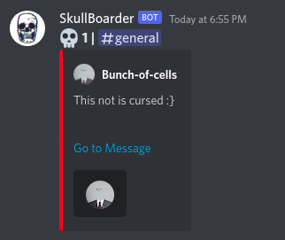

# SkullBoarder
SkullBoard's your skully messages 💀💀

</img>

## Commands
### !setskull \<number\>
  sets the minimum number of skulls required on a message to go to skullboard

### !setchannel
  sets the channel where the bot should post the skulled messages. The channel in which this ccommand is run is seleted. If the channel is not slected, the bot will not post anything
